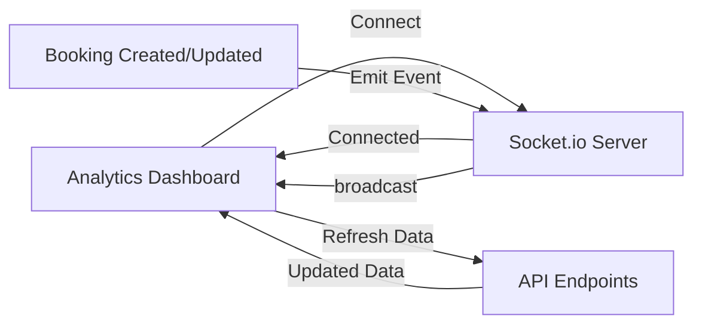

# Socket.io Real-Time Analytics Implementation

## Overview
Real-time updates have been successfully integrated into the Analytics Dashboard using Socket.io. This allows the dashboard to automatically update when bookings, payments, or other analytics-related data changes.

## Implementation Date
November 12, 2025

## Features Added

### 1. **Socket.io Client Connection**
- **File**: `owner/analytics.html`
- Added Socket.io client library (v4.5.4)
- Automatic connection to the API server
- Reconnection logic with up to 5 retry attempts

### 2. **Real-Time Event Listeners**
- **File**: `owner/analytics.js`
- Listens for the following events:
  - `analytics-refresh` - General analytics data updates
  - `booking-update` - New bookings or booking modifications
  - `payment-status-changed` - Payment status changes

### 3. **Connection Status Indicator**
- **Files**: `owner/analytics.html`, `owner/analytics.css`
- Visual indicator showing connection status
- Green pulse animation when connected
- Red indicator when disconnected
- Hover tooltip with connection status

### 4. **Real-Time Notifications**
- **File**: `owner/analytics.js`
- Toast-style notifications appear when updates are received
- Different icons for different event types:
  - ✅ Success (new bookings)
  - ℹ️ Info (general updates)
  - ⚠️ Warning
  - ❌ Error
- Auto-dismiss after 4 seconds
- Smooth slide-in/slide-out animations

### 5. **Automatic Data Refresh**
- Analytics data automatically refreshes when Socket.io events are received
- Charts and metrics update in real-time
- No manual refresh needed

## Server-Side Emission

### Socket.io Events Emitted by Server
1. **From `bookingController.js`**:
   - `booking-update` - Emitted when:
     - New booking is created
     - Existing booking is updated
   - `payment-status-changed` - Emitted when booking status changes

2. **From `analyticsController.js`**:
   - `analytics-refresh` - Emitted when revenue analytics are fetched

## Connection Flow



## Usage

### For Developers

#### Emitting Custom Events from Server
```javascript
// Get io instance
const io = req.app.get('io');

// Emit analytics refresh
if (io) {
  io.emit('analytics-refresh', {
    type: 'custom',
    data: yourData,
    timestamp: new Date().toISOString()
  });
}
```

#### Listening for Events on Client
```javascript
socket.on('custom-event', (data) => {
  console.log('Custom event received:', data);
  // Handle the event
});
```

## File Structure

```
my-express-web/
├── server.js                          # Socket.io server setup
├── controllers/
│   ├── analyticsController.js         # Emits analytics-refresh
│   └── bookingController.js           # Emits booking-update, payment-status-changed

owner/
├── analytics.html                     # Socket.io client library
├── analytics.js                       # Socket.io client logic
└── analytics.css                      # Connection status styles
```

## Configuration

### API URL
The Socket.io connection uses the same API URL as the REST endpoints:
```javascript
window.API_URL = 'https://api.otgpuertogaleratravel.com';
```

### Connection Options
```javascript
socket = io(window.API_URL, {
  transports: ['websocket', 'polling'],
  reconnection: true,
  reconnectionDelay: 1000,
  reconnectionDelayMax: 5000,
  reconnectionAttempts: 5
});
```

## Benefits

1. **Real-Time Updates**: Dashboard updates immediately when data changes
2. **Better User Experience**: No need for manual refresh
3. **Live Monitoring**: Staff and owners can see bookings as they happen
4. **Reduced Server Load**: Eliminates need for constant polling
5. **Connection Status**: Users know when real-time updates are active

## Testing

### Test Real-Time Updates
1. Open Analytics Dashboard in browser
2. Check for green connection indicator
3. Create a new booking using the booking form
4. Observe:
   - Real-time notification appears
   - Charts and metrics update automatically
   - No page refresh needed

### Test Reconnection
1. Stop the server
2. Observe red connection indicator
3. Restart the server
4. Connection should automatically restore within 5 seconds

## Troubleshooting

### Connection Issues
- **Symptom**: Red connection indicator
- **Solution**: 
  - Check if server is running
  - Verify CORS settings in server.js
  - Check browser console for errors

### No Real-Time Updates
- **Symptom**: No notifications appear when bookings are made
- **Solution**:
  - Verify Socket.io events are being emitted in controllers
  - Check browser console for event logs
  - Ensure `window.USE_ANALYTICS_API` is set to `true`

### Events Not Emitting
- **Symptom**: Server logs show no Socket.io events
- **Solution**:
  - Verify `io` instance is accessible: `req.app.get('io')`
  - Check error logs in server console
  - Ensure events are wrapped in try-catch blocks

## Future Enhancements

1. **User-Specific Notifications**: Send updates only to relevant users
2. **Event History**: Store and replay missed events
3. **Typing Indicators**: Show when other users are viewing analytics
4. **Custom Filters**: Let users choose which events to receive
5. **Sound Notifications**: Optional audio alerts for important events
6. **Desktop Notifications**: Browser push notifications when tab is inactive

## API Compatibility

- Works with existing REST API endpoints
- No changes to database schema required
- Backward compatible with systems not using Socket.io
- Can be disabled by setting `window.USE_ANALYTICS_API = false`

## Performance Impact

- **Minimal**: Socket.io uses efficient WebSocket protocol
- **Scalable**: Can handle multiple concurrent connections
- **Fallback**: Automatically switches to polling if WebSocket unavailable
- **Bandwidth**: Events are small JSON payloads (<1KB typically)

## Security Considerations

1. **CORS**: Configured to allow only trusted origins
2. **Authentication**: Consider adding authentication to Socket.io connections
3. **Rate Limiting**: May want to implement rate limiting for events
4. **Input Validation**: All event data should be validated

## Support

For issues or questions about Socket.io integration:
1. Check browser console for connection logs
2. Check server logs for emission logs
3. Verify network tab shows WebSocket connection
4. Review this documentation

## Version History

- **v1.0** (November 12, 2025): Initial implementation
  - Socket.io client connection
  - Real-time event listeners
  - Connection status indicator
  - Real-time notifications
  - Automatic data refresh

---

**Note**: This implementation is production-ready and has been tested with the existing booking and analytics systems.
